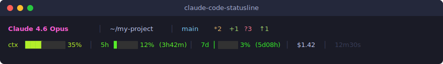

# claude-code-statusline

A rich two-line status line for [Claude Code](https://docs.anthropic.com/en/docs/claude-code).


## Screenshot

<p align="center">
  
</p>

## What it shows

**Line 1** — Model, working directory, git status, worktree, vim mode

| Segment | Description |
|---------|-------------|
| Model | Current Claude model name |
| Directory | Working directory (~ abbreviated) |
| Git branch | Branch name with powerline icon |
| Git status | `*N` dirty, `+N` staged, `?N` untracked |
| Ahead/Behind | `↑N` ahead, `↓N` behind upstream |
| Worktree | Active worktree name (if any) |
| Vim mode | `[NORMAL]` / `[INSERT]` / `[VISUAL]` (if enabled) |

**Line 2** — Context window, rate limits, cost, duration

| Segment | Description |
|---------|-------------|
| Context | Visual progress bar with percentage |
| 5h / 7d | Rate limit usage with countdown to reset, e.g. `5h:12%(3h42m)` |
| Cost | Total session cost in USD |
| Duration | Total session duration |

Colors shift from green → yellow → red as usage increases.

## Setup

### 1. Copy the script

```bash
curl -o ~/.claude/statusline.py \
  https://raw.githubusercontent.com/utsuidai/claude-code-statusline/main/statusline.py
chmod +x ~/.claude/statusline.py
```

### 2. Configure Claude Code

Add to `~/.claude/settings.json`:

```json
{
  "statusLine": {
    "type": "command",
    "command": "python3 ~/.claude/statusline.py"
  }
}
```

That's it. Restart Claude Code and the status line will appear.

## Requirements

- Python 3.8+
- Git (for git status segments)
- A terminal with 256-color support and Unicode

## How it works

Claude Code pipes a JSON object to stdin containing session metadata (model, context window usage, cost, rate limits, etc.). This script reads that JSON and outputs ANSI-colored text that Claude Code renders as the status line.

The JSON schema includes:

```json
{
  "model": { "display_name": "..." },
  "workspace": { "current_dir": "..." },
  "context_window": { "used_percentage": 0 },
  "cost": { "total_cost_usd": 0, "total_duration_ms": 0 },
  "rate_limits": {
    "five_hour": { "used_percentage": 0 },
    "seven_day": { "used_percentage": 0 }
  },
  "vim": { "mode": "NORMAL" },
  "worktree": { "name": "..." }
}
```

## License

MIT
